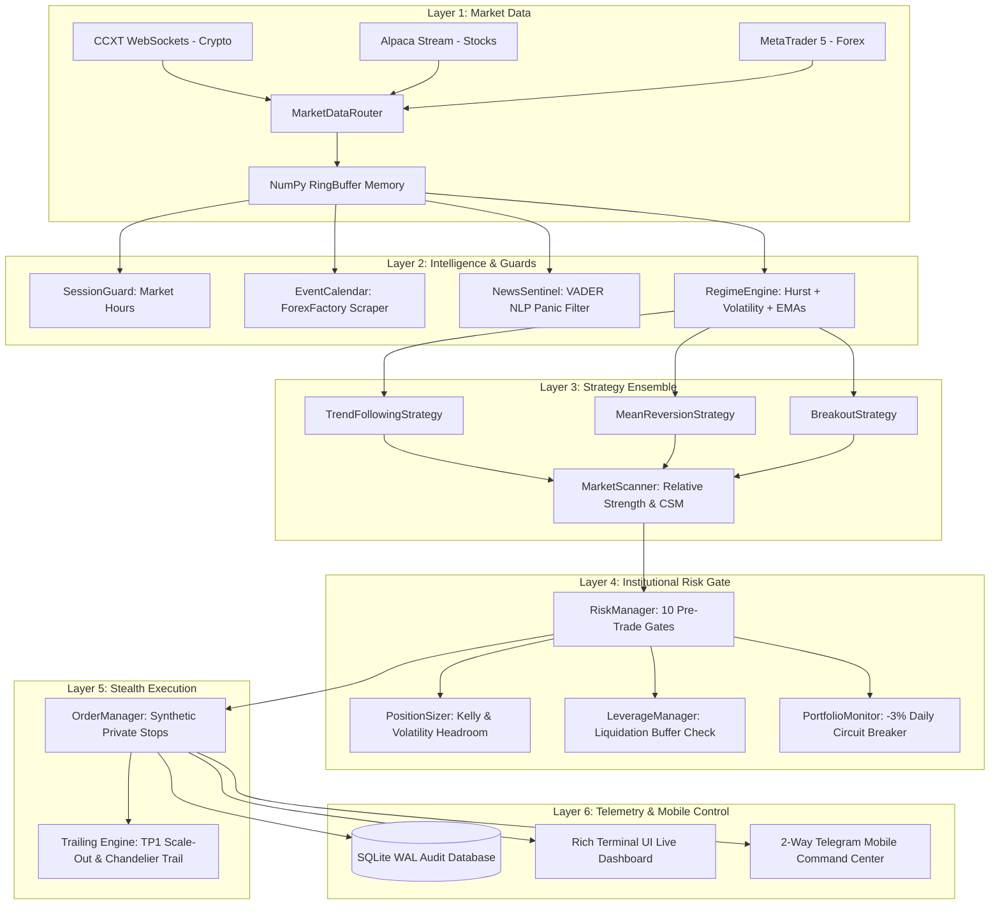

# 📘 THE QUANT HANDBOOK
## *Architecture, Mathematics & Operational Bible of the Brent Quant Engine*
**Version 1.0 — Production Edition**  
*Compiled for Egerton & Brent Website Ecosystem*

---

# Foreword: The Philosophy of Survival First

> *"The elements of good trading are: (1) cutting losses, (2) cutting losses, and (3) cutting losses. If you can follow these three rules, you may have a chance."*  
> — **Ed Seykota**

Most retail traders approach markets asking: *"How much money can I make today?"*  
Institutional quantitative firms ask: *"What is the maximum I can lose on this trade, and how do I survive a black swan event?"*

This fundamental shift in perspective separates the 95% of retail traders who blow up their accounts within 90 days from the quantitative systems that compound wealth over decades. This trading engine was engineered from the first line of code with **capital preservation as the primary objective**, and **alpha generation as the consequence of discipline**.

---

# CHAPTER 1: SYSTEM ARCHITECTURE & DATA FLOW

The engine operates on a clean, decoupled **6-tier modular pipeline**. No single component makes execution decisions in isolation.



---

# CHAPTER 2: THE MATHEMATICAL FOUNDATIONS

### 1. Fractal Persistence & The Hurst Exponent ($H$)
Financial price series are neither pure random walks nor pure trends; their behavior changes dynamically over time. The engine calculates the **Hurst Exponent** using the Rescaled Range ($R/S$) method:

$$\frac{R(n)}{S(n)} \approx C \cdot n^H$$

Where:
* **$H < 0.45$ (Mean-Reverting Regime)**: Prices exhibit negative autocorrelation. When price deviates, it tends to snap back to the mean. The engine unlocks the **`MeanReversionStrategy`** (Bollinger / Keltner Bands).
* **$H > 0.55$ (Trending Regime)**: Prices exhibit long-memory persistence. A positive return is likely followed by another positive return. The engine unlocks **`TrendFollowingStrategy`** and **`BreakoutStrategy`**.
* **$0.45 \le H \le 0.55$ (Random Walk / Noise)**: The series approximates Brownian motion. Trading here is gambling; the engine strictly **blocks all directional orders**.

### 2. Yang-Zhang Volatility Estimation ($\sigma_{YZ}^2$)
Standard Close-to-Close volatility fails to account for overnight market gaps and intraday high/low extremes. The engine employs the **Yang-Zhang (2000) volatility estimator**, an unbiased minimum-variance estimator that combines overnight jump volatility, continuous drift, and Rogers-Satchell open-to-close variance:

$$\sigma_{YZ}^2 = \sigma_o^2 + k\sigma_c^2 + (1-k)\sigma_{RS}^2$$

Where:
$$\sigma_o^2 = \frac{1}{n-1}\sum \left(\ln \frac{O_t}{C_{t-1}} - \mu_o\right)^2$$
$$\sigma_c^2 = \frac{1}{n-1}\sum \left(\ln \frac{C_t}{O_t} - \mu_c\right)^2$$
$$\sigma_{RS}^2 = \frac{1}{n}\sum \left[\ln \frac{H_t}{C_t}\ln \frac{H_t}{O_t} + \ln \frac{L_t}{C_t}\ln \frac{L_t}{O_t}\right]$$
$$k = \frac{0.34}{1.34 + \frac{n+1}{n-1}}$$

This yields an institutional-grade volatility measure that accurately calibrates our Average True Range ($\text{ATR}$) stops.

### 3. Half-Kelly Information Sizing
To solve the trade-off between maximizing capital growth and eliminating risk of ruin, the engine incorporates the **Kelly Criterion** ($f^*$), scaled down by a conservative $0.5\times$ multiplier (**Half-Kelly**):

$$f^* = \frac{p(b + 1) - 1}{b}$$
$$f_{\text{trade}} = \min\left(0.5 \cdot f^*, \text{MaxRiskPct}\right)$$

Where:
* $p$ = empirical win rate calculated by `PerformanceTracker` from the last 30 closed trades.
* $b$ = payout ratio ($\text{Average Win} / \text{Average Loss}$).
* If a strategy experiences negative edge ($f^* \le 0$), trade sizing automatically collapses to zero.

---

# CHAPTER 3: DEFENSIVE ARCHITECTURE & RISK GATES

Before any order reaches a broker, it must pass through **10 sequential pre-trade gates** in [`risk/risk_manager.py`](file:///c:/Users/egerton/Desktop/BRENT%20WEBSITE/quant_engine/risk/risk_manager.py):

| Gate # | Check Name | Logic & Protection |
|---|---|---|
| **1** | **Actionable Direction** | Validates that the signal is either explicit `LONG` or `SHORT`. |
| **2** | **Confidence Floor** | Rejects any signal with confidence score $< 25\%$. |
| **3** | **Regime Filter** | Blocks trades if current market regime is `HIGH_VOL_CHAOS` or unclassified. |
| **4** | **Session Guard** | Ensures market liquidity (e.g. Forex London/NY overlap, stocks open, weekends). |
| **5** | **Event Blackout** | Checks ForexFactory calendar; halts entries 15m before high-impact economic news. |
| **6** | **News Panic Filter** | Scans news sentiment; blocks entries during negative sentiment spikes ($<-0.4$). |
| **7** | **Portfolio Capacity** | Enforces max concurrent position limit (default 10) and portfolio availability. |
| **8** | **Position Sizing** | Dynamically calculates quantity so max risk represents exactly $1.0\%$ of equity. |
| **9** | **Broker Minimum** | Verifies quantity meets exchange lot minimums (e.g. Binance min notional). |
| **10** | **Liquidation Guard** | **(Leverage)** Blocks trades if exchange liquidation price is within $1.5\times\text{ATR}$ of entry. |

### The Portfolio Circuit Breaker
If cumulative realized and unrealized daily losses breach **$-3.0\%$ of starting equity**:
1. All trading operations are immediately suspended.
2. An asynchronous emergency callback closes all open positions.
3. An alert is dispatched via Telegram.
4. Trading remains locked until midnight UTC reset.

---

# CHAPTER 4: ALPHA ENGINES (PROFIT MAXIMIZATION)

### 1. Dynamic Scaling Out & The "Free Ride" Trailing Engine
Rather than closing 100% of a trade at a static take-profit, the engine executes a **two-stage exit**:
* **Stage 1 (Cash In)**: When price reaches $\text{Entry} + (2.0 \times \text{ATR})$, the bot instantly closes **50% of the position** to bank guaranteed profit.
* **Stage 2 (Risk-Free Stop)**: Concurrently, the stop loss on the remaining 50% is raised to $\text{Entry} + (0.2 \times \text{ATR})$. The trade is now **mathematically risk-free**.
* **Stage 3 (Chandelier Trailing Stop)**: The remaining 50% trails behind the highest price reached by $2.5 \times \text{ATR}$. As long as a trend continues to make new highs, the stop ratchets upward automatically, capturing multi-day runners.

### 2. Relative Strength & Currency Strength Meter (CSM)
Rather than cycling symbols alphabetically:
* **Crypto/Equities**: Evaluates $\text{Momentum} / \text{Volatility Ratio}$ across all pairs over 20 bars; allocates capital to the top 3 highest-momentum assets.
* **Forex**: Calculates net relative strength for `USD`, `EUR`, `GBP`, `JPY`, `AUD`, `CAD`, `CHF`, `NZD`, pairing the strongest currency against the weakest for maximum trend velocity.

---

# CHAPTER 5: STEALTH EXECUTION & PRIVATE STOPS

### The Synthetic Stop Protocol
Placing resting stop-loss orders on public exchange order books exposes retail traders to **stop hunting** by high-frequency market makers.

The Brent Quant Engine employs **Synthetic Stops**:
* Stop-loss and take-profit coordinates exist **only in private memory** on the server.
* The background order loop polls exchange mark prices every 1,000ms.
* When price breaches the threshold, the bot sends an immediate **aggressive IOC / Market order** to exit the position.
* The market cannot see your exit levels until the order is already filled.

---

# CHAPTER 6: 2-WAY MOBILE COMMAND CENTER

The engine is tethered to your Telegram app via `@Eclat_quant_bot`. It verifies your Telegram User ID on every incoming transmission to ensure zero unauthorized access.

### Mobile Command Reference:
* `/status` — Requests live portfolio equity, daily P&L ($ and %), circuit breaker state, and active trade count.
* `/positions` (or `/position`) — Detailed inspection of each open trade: entry, current price, unrealized P&L, stop price, and `[🚀TRAIL]` / `[🛡️BE]` flags.
* `/pause` — Freezes entry gates before major news while allowing trailing stops on existing positions to run.
* `/resume` — Restores automatic scanning and trade execution.
* `/closeall` — **Emergency Panic Button**: Instantly market-closes 100% of active positions across all brokers in 1 second.
* `/report` — Pulls today's trade log from `db/trades.sqlite` and calculates net realized performance.
* `/help` — Displays command directory.

---

# CHAPTER 7: OPERATIONAL PLAYBOOK

### Starting the Bot (Paper Mode):
```powershell
cd "c:\Users\egerton\Desktop\BRENT WEBSITE\quant_engine"
python main.py --mode paper
```

### Running the Full Regression Test Suite:
```powershell
python -m pytest tests/ -v --tb=short
```

### Previewing the Terminal Dashboard Alone:
```powershell
python -m monitoring.dashboard
```

---

# CHAPTER 8: GROWTH & RESEARCH ROADMAP

As the bot compounds capital and the account expands, the following research avenues are scheduled for future upgrades:

```
[Phase 1] Core Engine + Regime Filters + 20 Tests          ✅ COMPLETE
[Phase 2] Terminal Live Dashboard                          ✅ COMPLETE
[Phase 3] Safe Leverage Mode + Liquidation Guard           ✅ COMPLETE
[Phase 4] Alpha Expansion (Trailing Stop, Scanner, Kelly)  ✅ COMPLETE
[Phase 5] 2-Way Mobile Telegram Command Center             ✅ COMPLETE
----------------------------------------------------------------------
[Phase 6] FastAPI Web Dashboard & Chart UI                ⏳ UPCOMING
[Phase 7] Automated Profit Sweeps & Reserve Vault          ⏳ UPCOMING
[Phase 8] Cloud VPS Deployment (Oracle 24/7 Service)       ⏳ UPCOMING
[Phase 9] Walk-Forward Parameter Optimizer                 ⏳ UPCOMING
```

---
*The Quant Handbook is maintained under active development. Every modification to strategies, risk multipliers, and execution models should be documented within these pages.*
